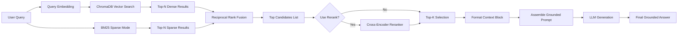

# Architecture — RAG Pipeline (Day 08 Lab)

> Template: Điền vào các mục này khi hoàn thành từng sprint.
> Deliverable của Documentation Owner.

## 1. Tổng quan kiến trúc

```
[Raw Docs]
    ↓
[index.py: Preprocess → Chunk → Embed → Store]
    ↓
[ChromaDB Vector Store]
    ↓
[rag_answer.py: Query → Retrieve → Rerank → Generate]
    ↓
[Grounded Answer + Citation]
```

**Mô tả ngắn gọn:**
> Hệ thống RAG hỗ trợ nhân viên nội bộ tra cứu nhanh chóng và chính xác các quy định, chính sách, hướng dẫn từ các phòng ban (CS, IT, HR). Bằng cách kết hợp ChromaDB và LLM với chiến lược Hybrid Search + Rerank, hệ thống giải quyết vấn đề tìm kiếm thông tin không hiệu quả, cung cấp câu trả lời có trích dẫn nguồn uy tín.

---

## 2. Indexing Pipeline (Sprint 1)

### Tài liệu được index
| File | Nguồn | Department | Số chunk |
|------|-------|-----------|---------|
| `policy_refund_v4.txt` | policy/refund-v4.pdf | CS | ~10 |
| `sla_p1_2026.txt` | support/sla-p1-2026.pdf | IT | ~10 |
| `access_control_sop.txt` | it/access-control-sop.md | IT Security | ~15 |
| `it_helpdesk_faq.txt` | support/helpdesk-faq.md | IT | ~12 |
| `hr_leave_policy.txt` | hr/leave-policy-2026.pdf | HR | ~15 |

### Quyết định chunking
| Tham số | Giá trị | Lý do |
|---------|---------|-------|
| Chunk size | 400 tokens | Tối ưu với các text-embedding models và duy trì đủ ngữ cảnh 1 đoạn văn. |
| Overlap | 80 tokens | Không làm đứt mạch văn bản, giữ lại đủ context cho chunk sau. |
| Chunking strategy | Heading-based / paragraph-based | Chia theo từng section và paragraph trước để cắt tài liệu chuẩn semantic, thay vì cắt ngang từ một cách cơ học. |
| Metadata fields | source, section, effective_date, department, access | Phục vụ metadata filter, freshness filter, và citation khi LLM tạo answer. |

### Embedding model
- **Model**: OpenAI text-embedding-3-small (fallback: paraphrase-multilingual-MiniLM-L12-v2)
- **Vector store**: ChromaDB (PersistentClient)
- **Similarity metric**: Cosine

---

## 3. Retrieval Pipeline (Sprint 2 + 3)

### Baseline (Sprint 2)
| Tham số | Giá trị |
|---------|---------|
| Strategy | Dense (embedding similarity) |
| Top-k search | 10 |
| Top-k select | 3 |
| Rerank | Không |

### Variant (Sprint 3)
| Tham số | Giá trị | Thay đổi so với baseline |
|---------|---------|------------------------|
| Strategy | Hybrid (dense + sparse) | Đổi từ dense sang hybrid |
| Top-k search | 10 | Giữ nguyên |
| Top-k select | 3 | Chọn lọc kỹ hơn bằng rerank |
| Rerank | Cross-encoder | Thêm Rerank qua ms-marco-MiniLM-L-6-v2 |
| Query transform | Có (expansion) | Biến đổi query để tăng độ phủ |

**Lý do chọn variant này:**
> Cơ sở dữ liệu và query của người dùng có ngôn ngữ tự nhiên lẫn từ khoá kỹ thuật, tên lỗi (ví dụ: ERR-403-AUTH, P1). Dense model khó cover các exact matches mã lỗi. Hybrid Search (BM25 + Dense) với RRF mang lại kết quả hội tụ tuyệt vời. Thêm Reranking (cross-encoder) giúp các docs có độ liên quan chặt chẽ thực sự được chọn vào top 3.

---

## 4. Generation (Sprint 2)

### Grounded Prompt Template
```
<persona>
You are an internal policy assistant for the company...
</persona>

<rules>
- ALWAYS check retrieved document context before answering...
- ALWAYS cite the source document and section...
</rules>

Question: {query}

Context:
[1] {source} | {section} | score={score}
{chunk_text} ...

Answer:
```

### LLM Configuration
| Tham số | Giá trị |
|---------|---------|
| Model | gpt-4o-mini / gemini-1.5-flash |
| Temperature | 0 (để output ổn định cho eval) |
| Max tokens | 512 |

---

## 5. Failure Mode Checklist

> Dùng khi debug — kiểm tra lần lượt: index → retrieval → generation

| Failure Mode | Triệu chứng | Cách kiểm tra |
|-------------|-------------|---------------|
| Index lỗi | Retrieve về docs cũ / sai version | `inspect_metadata_coverage()` trong index.py |
| Chunking tệ | Chunk cắt giữa điều khoản | `list_chunks()` và đọc text preview |
| Retrieval lỗi | Không tìm được expected source | `score_context_recall()` trong eval.py |
| Generation lỗi | Answer không grounded / bịa | `score_faithfulness()` trong eval.py |
| Token overload | Context quá dài → lost in the middle | Kiểm tra độ dài context_block |

---

## 6. Diagram (tùy chọn)


