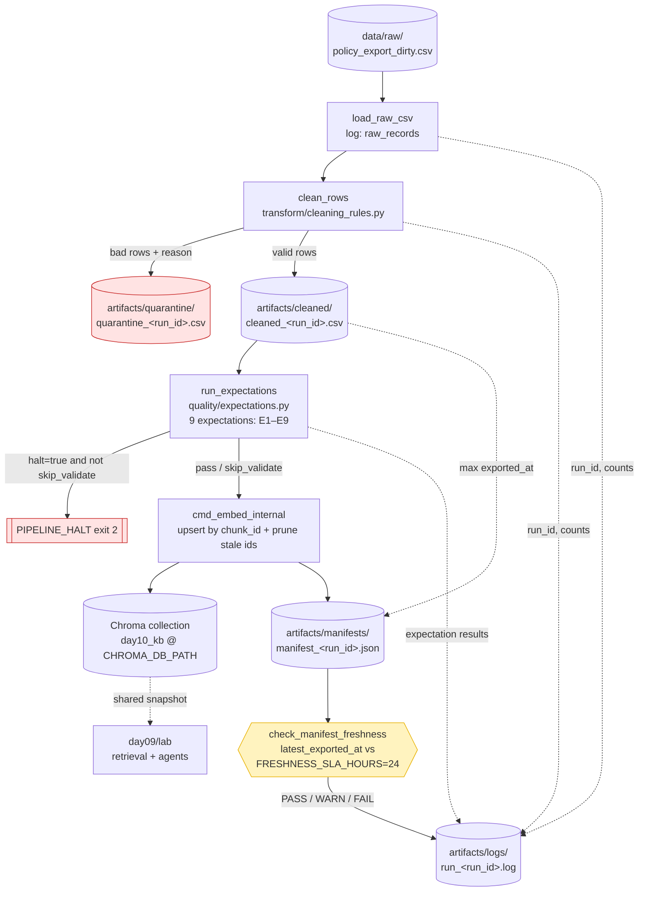

# Kiến trúc pipeline — Lab Day 10

**Nhóm:** E4  
**Cập nhật:** 2026-04-15

---

## 1. Sơ đồ luồng

**Freshness probe:** đọc `latest_exported_at` trong manifest, so với `FRESHNESS_SLA_HOURS` (default 24h) → trả `PASS | WARN | FAIL`.
**`run_id` được ghi vào:** header log (`run_id=…`), trường `manifest.run_id`, và metadata từng chunk trong Chroma (`etl_pipeline.py:170`).
**Quarantine:** mỗi dòng có thêm cột `reason` để truy vết (`unknown_doc_id`, `missing_effective_date`, `invalid_effective_date_format`, `stale_hr_policy_effective_date`, `duplicate_chunk_text`, `chunk_text_too_short`, `contains_draft_or_error_keywords`).

---

## 2. Ranh giới trách nhiệm

| Thành phần | Input | Output | Owner nhóm |
|------------|-------|--------|--------------|
| Ingest | `data/raw/policy_export_dirty.csv` (CSV export từ hệ nguồn) | `List[Dict]` + log `raw_records`, `run_id` | Ingestion Owner |
| Transform | raw rows | `cleaned_<run_id>.csv` (schema 5 cột) + `quarantine_<run_id>.csv` (kèm `reason`) | Cleaning / Quality Owner |
| Quality | cleaned rows | 9 `ExpectationResult` (E1–E9) + `halt` flag; halt → pipeline exit 2 | Cleaning / Quality Owner |
| Embed | `cleaned_<run_id>.csv` | Chroma collection `day10_kb`: upsert theo `chunk_id`, prune id đã biến mất; log `embed_upsert count`, `embed_prune_removed` | Embed Owner |
| Monitor | `manifest_<run_id>.json` | `PASS / WARN / FAIL` + `age_hours`, `sla_hours`; runbook diagnosis | Monitoring / Docs Owner |

---

## 3. Idempotency & rerun

**Chiến lược:** upsert theo `chunk_id` ổn định + prune.

- `chunk_id = "{doc_id}_{seq}_{sha256(doc_id|text|seq)[:16]}"` (`transform/cleaning_rules.py:38-40`) — cùng `(doc_id, chunk_text, seq)` luôn sinh cùng id.
- `col.upsert(ids=ids, …)` (`etl_pipeline.py:175`) ghi đè id cũ thay vì append.
- `col.delete(ids=prev_ids - current_ids)` (`etl_pipeline.py:158-162`) xoá vector đã biến mất khỏi cleaned — index luôn là snapshot của lần publish hiện tại.
- Bảo vệ thêm bằng expectation **E9 `unique_chunk_ids`** (severity `halt`) — nếu cleaned có `chunk_id` trùng, pipeline dừng trước khi embed.

**Rerun 2 lần:** không duplicate vector. `upsert` không tạo bản ghi mới; `prune` giữ index sạch. Cùng raw → cùng ids → cùng vector.

**Caveat đã ghi nhận:**
- `--skip-validate` cho phép embed cả khi expectation halt (chỉ dùng cho demo Sprint 3 `inject-bad`).
- `--no-refund-fix` đổi text (`"14 ngày làm việc"` giữ nguyên) → sinh `chunk_id` khác → id cũ bị prune. Đây là hành vi mong muốn để chứng minh before/after.

---

## 4. Liên hệ Day 09

- **Corpus nguồn:** hai lab cùng dùng `data/docs/*.txt` (`policy_refund_v4`, `sla_p1_2026`, `it_helpdesk_faq`, `hr_leave_policy`, `access_control_sop`) — xem `contracts/data_contract.yaml:41-49`.
- **Kênh publish:** Day 10 ETL ghi vector snapshot vào Chroma collection `day10_kb` tại `CHROMA_DB_PATH` (cấu hình qua `.env`). Day 09 agent retrieval đọc **cùng** collection đó.
- **Hệ quả:** mỗi `python etl_pipeline.py run` thành công = refresh corpus cho Day 09 — agent Day 09 lập tức thấy policy đã fix (refund 14→7, HR 12 ngày).
- **Truy vết ngược:** mỗi chunk trong Chroma mang metadata `run_id`, nên câu trả lời Day 09 có thể trace về đúng manifest / log của lần ETL.

---

## 5. Rủi ro đã biết

- **Stale HR 10 ngày có thể lọt:** rule quarantine phụ thuộc `doc_id == "hr_leave_policy"` và `effective_date < 2026-01-01` (`cleaning_rules.py:108`). Nếu upstream đổi tên doc_id hoặc effective_date bị parser đưa về format lạ, bản cũ có thể lọt qua. E6 `hr_leave_no_stale_10d_annual` là lưới an toàn chặn ở tầng expectation.
- **Fix refund 14→7 là string replace thuần:** `cleaning_rules.py:146-152` thay literal `"14 ngày làm việc"`. Chỉ cần upstream viết `"14 ngày lam viec"` / `"14 business days"` là rule miss — nhưng E3 `refund_no_stale_14d_window` sẽ halt, tránh publish im lặng.
- **`--skip-validate`** cho phép embed cả khi halt → hữu ích cho demo Sprint 3 nhưng là foot-gun nếu chạy nhầm production; manifest có flag `skipped_validate=true` để truy vết.
- **Freshness chỉ dựa trên `latest_exported_at` trong manifest**, không so với watermark DB nguồn (`monitoring/freshness_check.py`). Nếu export stuck ở timestamp cũ nhưng DB nguồn vẫn fresh, SLA vẫn PASS sai.
- **Prune xoá id vắng mặt** (`etl_pipeline.py:158-162`): chạy partial (subset raw) sẽ làm teo index. Luôn chạy full batch; không commit `--run-id` test lên production collection.
- **Allowlist doc_id hard-code 2 nơi:** `cleaning_rules.py:16-23` và `contracts/data_contract.yaml:52-56` dễ lệch khi thêm doc mới. Cần review cả hai file khi mở rộng nguồn.
- **Bằng chứng thực tế lần chạy gần nhất** (`manifest_2026-04-15T09-07Z.json`): 10 raw → 6 cleaned → 4 quarantine (1 duplicate, 1 missing_effective_date, 1 stale_hr, 1 unknown_doc_id). Nếu con số này thay đổi đột ngột giữa các run với cùng raw → dấu hiệu rule hoặc raw drift.
